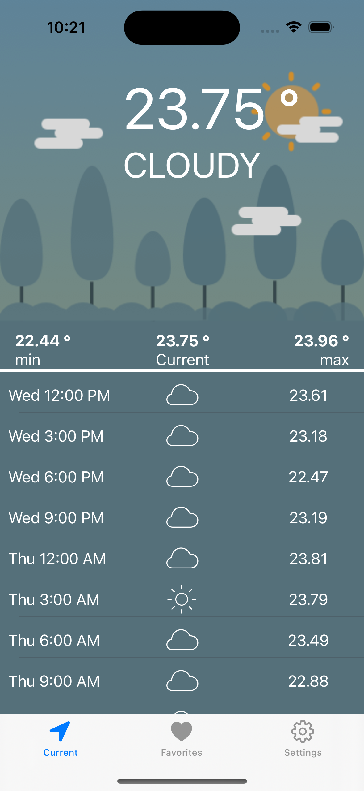
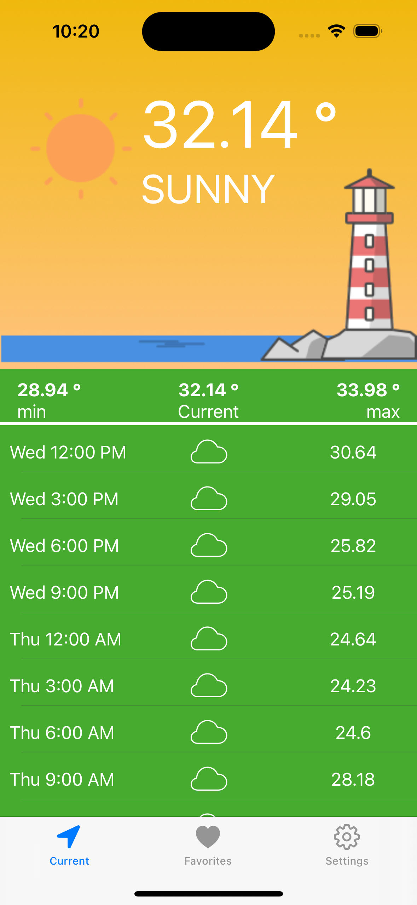
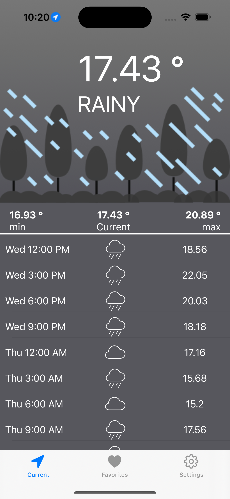
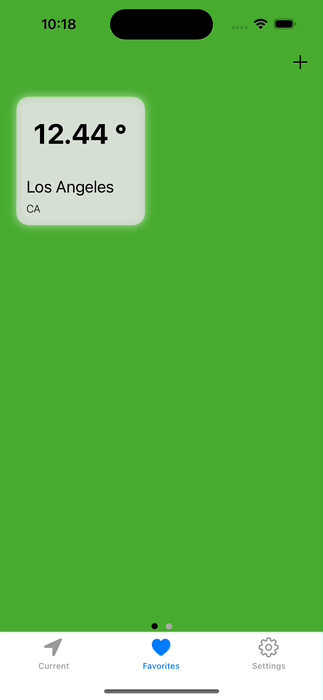
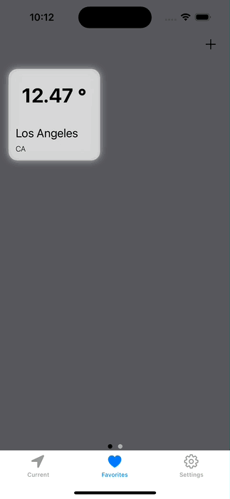
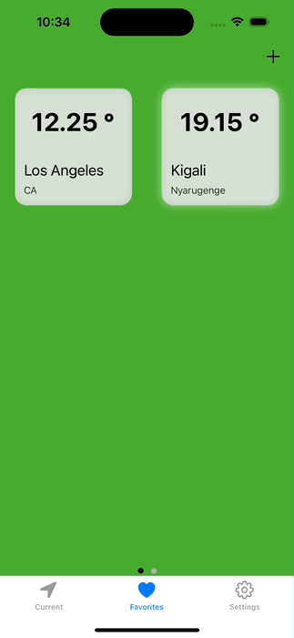
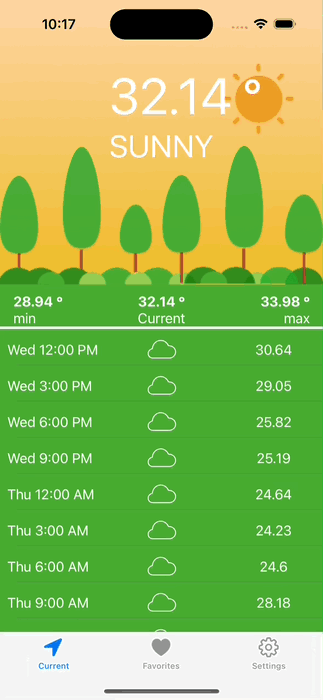
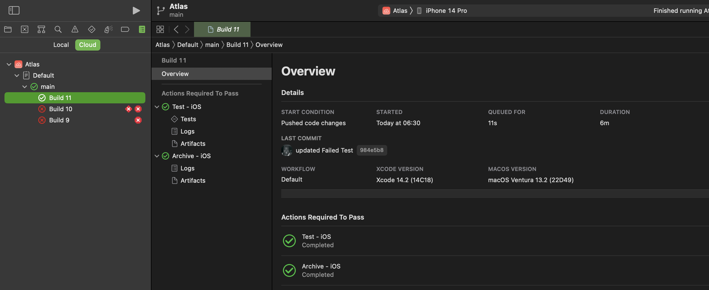

# Atlas

[](https://opensource.org/licenses/MPL-2.0)

[](https://developer.apple.com/swift)
[](http://makeapullrequest.com)
[](http://twitter.com/byaruhaf)

## Overview

Atlas is a partial demo of a weather app using the openweathermap.org API.
This branch was Compiled with Xcode 14.2.0, and Swift 5.7 and supports iOS 16 and above.

Project Documentation generate using **Apples DocC** can be accessed using this link [Documentation](https://byaruhaf.github.io/Atlas/documentation/atlas/)

## Secrets Management

This app requires a 3rd party API key from https://openweathermap.org. You can get your own free key
by signing up for an account, then creating a new API Key here:

https://home.openweathermap.org/api_keys

Next you'll right-click on the `Configuration` folder in the Xcode sidebar, and select _Reveal in Finder_. Duplicate the file `secrets.template.xcconfig` and rename it to `secrets.xcconfig`. Then edit the file and enter your API Key there.

## Implementation Details

### App Navigation & Function

#### First Tab: Current

Shows the current temperature at the users current location

|             Cloudy             | Sunny                         | Rainy                         |
| :----------------------------: | :---------------------------- | :---------------------------- |
|  |  |  |

#### Second Tab: Favorites

Allows the user to add, remove, view and save temperature in his/her favorite cities.
The user can also swipe to a map view to view his/her favorite cities on a map.

|       Adding Favorites       | Swipe To Map View            | Removing Favorites           |
| :--------------------------: | :--------------------------- | :--------------------------- |
|  |  |  |

#### Third Tab: Settings

Allows the user to set the image theme for the first tab the choice is between the sea images and the forest images.


### Persistence

The Apps Persistence is implemented using UserDefaults.
UserDefaults is used to store the users favorite cities and last time the users current location weather data was updated

### Refresh Frequency

The App fetch's the weather data for the current location of the device every time the user opens the application.
The App also fetch's the weather data every time the user moves it from the background to the foreground.
For efficiency the background to the foreground update only happens the ten minutes or more have passed.
NB: Pull to refresh was also implemented, but disabled due to a concurrency bug.

### Security

- Secret Management API Keys are Stored in Xcode Configuration
- SSL/Certificate Pinning using Intermediate Certificate Authority (CA) certificates for openweathermap.org

### Logging

Proper logging using Apple unified logging system using the **Logger** type

### Continuous Integration & Deployment

Atlas uses Xcode Cloud to perform continuous integration and deployment.
Every push to the github repo is Built, Tested, Archive and Deploy to testflight for internal testing.
If any file changes Xcode Cloud will create a new build of the Atlas app on TestFlight.



### Coding Style

SwiftLint runs as part of the build process in the local Xcode & Xcode Cloud, and errors/warnings are surfaced in Xcode as well.

### Code coverage integration

with Unit & UI Testing the code coverage is 64%

### Known issues

- **UINavigationBar & Xcode 14 iOS 16 Bug**
  You get the following Xcode console message if you are using UINavigationController. The warning doesn't appear in iOS 15.

  ```
  2023-02-04 05:22:52.044903+0300 Atlas[19155:581143] [Assert] UINavigationBar decoded as unlocked for UINavigationController, or navigationBar delegate set up incorrectly. Inconsistent configuration may cause problems. navigationController=<UINavigationController: 0x7fddea817600>, navigationBar=<UINavigationBar: 0x7fdddb007630; frame = (0 59; 0 50); opaque = NO; autoresize = W; layer = <CALayer: 0x600001aa9580>> delegate=0x7fddea817600
  ```

  Various Forums also reporting the same issue are listed below. At the moment there is no fix we just have to wait for Apple to Squash this Bug.
  I have submitted a bug report to Apple

  - https://developer.apple.com/forums/thread/714278
  - https://stackoverflow.com/questions/74449249/xcode-14-1-error-uinavigationbar-decoded-as-unlocked-for-uinavigationcontrolle
  - https://www.reddit.com/r/iOSProgramming/comments/ytegwa/xcode_14_uinavigationbar_issue/
  - https://codecrew.codewithchris.com/t/error-regarding-navigation-bar-customization/21713
